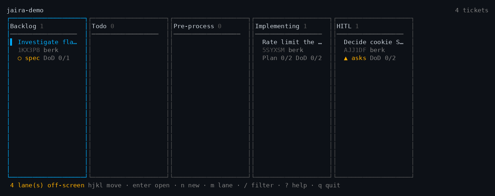
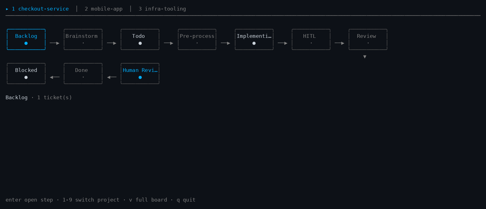
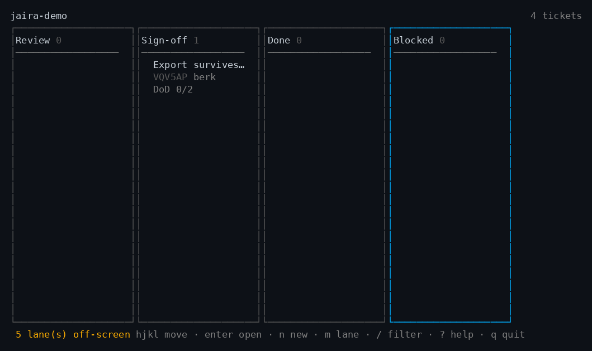

# jaira

A kanban board for the work you do with coding agents, stored as markdown files
inside your repository.

Hand a coding agent one task and it reliably becomes five. Within a session that
is fine. Across sessions it is not: what each sub-task was *for* and where it got
to both evaporate, and there is no artifact left to reconstruct them from.

jaira makes that state durable and visible. Tickets are files in the repo, so the
board travels with the code — a teammate clones, runs `jaira`, and sees the same
board. No server, no accounts, no setup.

```
repo/                              ~/.jaira/
├── .jaira/                        ├── lanes/       your custom lanes
│   └── tickets/*.md               ├── projects.json
└── src/                           └── state/<worktree>/   sessions, locks
```



One window over every project, with the whole flow on one screen — a dot per
ticket, agents counted per step, and the arrow lit where work just moved:



The repository holds only tickets. Everything ephemeral — what each session is
focused on, write locks — lives under your home directory, so `.jaira/` never
mixes committed content with scratch state.

## Install

```bash
go install github.com/BeMuCa/jaira/cmd/jaira@latest
```

Or download a binary from the releases page and put it on your `PATH`. It is a
single static executable with no runtime dependency — nothing to install
alongside it, no daemon, no database.

`git` is optional. jaira works fine in a directory that is not a repository; you
only lose the parts that are about sharing (`jaira share`, the merge driver).

## Start

```bash
cd your-repo
jaira init      # creates .jaira/ — private, gitignored
jaira           # opens the board
```

**A board starts private.** `init` gitignores it, so your tickets are yours alone.
When you want the team to have them:

```bash
jaira share
git add .jaira .gitignore && git commit -m "share jaira board"
```

Publishing is a decision rather than a default — the tool cannot know whether your
notes are ready to be read by everyone who can clone the repository. `jaira share
--undo` makes it private again; nothing about the tickets changes either way, so
it is not a migration.

Teammates then clone and run any jaira command; the merge driver binds itself on
first use.

## A ticket

```markdown
---
id: 01KZSAMZMANMNFNHS05J0VAG6T
title: Fix session cookie dropped on 302
status: in-progress
ready: true
creator: berk
assignee: berk
executed-by: haiku
goal: Session must survive the OAuth round-trip
context: |-
  Reported in chat while debugging Safari logouts. The cookie is dropped
  cross-site on the OAuth redirect, so users are silently logged out
  mid-flow. Reproduced on Safari only.
blocked-by: []
commits:
  - 4f2a1c9
model-tier: cheap
outcome-what: Set SameSite=Lax and re-issued the cookie on 302
outcome-why: The cookie was dropped cross-site, silently logging users out
outcome-resolves: >-
  The DoD asked for survival across the OAuth round-trip; re-issuing on
  redirect closes the gap, verified by session_test.go
created-at: 2026-08-11T21:11:27Z
updated-at: 2026-08-11T21:14:03Z
---

# Fix session cookie dropped on 302

## Definition of Done

- [x] session survives the OAuth round-trip
- [x] covered by a test
- [ ] reviewed and merged
```

The file format *is* the API. It is hand-editable, and writing one field rewrites
only that field's bytes — so a lane change shows up in git as a one-line diff, not
a reformatted file.

Three details are load-bearing:

- **`assignee` is always a human**, even when an agent does the work. The model is
  recorded separately as `executed-by`. Ownership of an outcome does not transfer
  to a language model.
- **`outcome-resolves`** is not a restatement of what changed. It is the argument
  that the change satisfies the definition of done — enough to review without
  opening the code.
- **The definition of done is a checklist in the body**, not a frontmatter string,
  because that is how acceptance criteria are actually written. It also earns its
  keep at the terminal lane: a ticked box is a human editing a file, which is
  evidence a model asserting "it works" cannot manufacture.
- **`external:`** is reserved for a future Jira/YouTrack adapter. jaira never
  interprets it and never rewrites it.

## The lanes

```
BACKLOG → TODO → PRE-PROCESS → IMPLEMENTING → HITL → REVIEW → SIGN-OFF → DONE
                                                │                  ▲
                                                └ needs you ───────┘        + BLOCKED
```

Anything can be thrown into the backlog. Nothing *leaves* it without a goal, a
definition of done, the context it came from, and an assignee.

That gate is the point of the tool. Capture should be frictionless and execution
should not be: an agent that starts work with no checkable target produces work
you cannot review. Acquiring a definition of done is the price of admission to a
run.

`REVIEW` is a **human checkpoint**: no agent may move a ticket out of it. The
review agent writes its verdict and stops; you accept the work in the board, or
raise a follow-up ticket that carries the context across and links back.

`DONE` requires every checklist item marked done — and the plan finished too, if
the ticket has one, since the criteria cannot have been met while the work that
meets them is still in progress.

A review agent cannot certify its own work. This is not politeness about AI — it
is that LLM-as-judge is measurably poor at catching real defects, so a terminal
state gated on a model's own assessment would mean nothing. There was once a
`--signal` flag that accepted free text as evidence and never checked it; it was
removed rather than repaired.

## Lanes are pipeline stages

A lane can bind a prompt, a model tier, and an input/output contract. That turns
the board from a progress display into a pipeline you can watch: a cheap model
implements, an expensive one reviews.

Custom lanes are single files in `~/.jaira/lanes/`, so sharing one is sending
someone the file.

```markdown
---
id: critique
name: Critique
after: review
precedence: 55
agentic: true
model-tier: strong
input-requires: [goal, definition-of-done, outcome-what, diff]
output-produces: [outcome-resolves]
---
# Prompt

Look for defects the implementer would not have noticed...
```

Ask the tool to assemble the input rather than letting the agent decide what
context matters:

```bash
jaira show JJN9KH --for-lane critique --json
```

That returns the prompt, only the declared fields, and the diff of the ticket's
own commits. If the agent chose its own context, the contract would be a
suggestion.

A teammate without your `critique` lane still sees those tickets — in a read-only
passthrough column. Hiding them would be the worse failure.

## Concurrency

Two people moving the same ticket both rewrite the same `status:` line. Line-based
merging calls that a conflict, on the single most common operation the whole system
performs.

So `jaira init` registers a **field-aware merge driver** for the clone:

| Field | Resolution |
|---|---|
| `status` | whichever lane is further along — never revert progress |
| `blocked-by`, `commits` | union; neither side's addition is lost |
| other scalars | the more recent `updated-at` wins |
| prose (`goal`, `outcome-*`, body) | a real conflict, scoped to that field |

A conflicted ticket stays valid YAML — the contested value is parked in a
`conflict-theirs-<field>` key and listed under `merge-conflicts`, rather than the
file being filled with markers. Conflict markers would make the frontmatter
unparseable and blank the ticket on everyone's board until someone resolved it.
`jaira resolve` shows both sides and can take either.

Registration writes to `.git/config`, because git deliberately does not let a
clone configure an executable on your behalf. jaira says so when it does it rather
than acting quietly.

Known limit: merge drivers only run for merges git performs locally. A conflict
resolved through a hosting provider's web UI falls back to line-level markers.

Within one machine, concurrent CLI calls take a per-ticket lock and write
atomically, because a single write path prevents schema drift but does nothing
about two processes interleaving.

## With Claude Code

Install the skill from `.claude/skills/jaira/` and Claude will use the CLI
directly. Optionally install `hooks/sync-tasks.sh` as a `PostToolUse` hook on the
task tools to mirror Claude's task list into the backlog.

Mirrored tickets land in the backlog behind the gate. Lane movement is
deliberately *not* mirrored: letting an external status push a ticket into the
pipeline would route around the gate that makes the pipeline worth having.

The sync is idempotent — a task already mapped to a ticket updates it rather than
creating a second one, and an unchanged list writes nothing — so a
board→tasks→board round trip settles instead of oscillating.

## Working with an agent

The whole integration surface is: run a command, read the JSON, branch on the
exit code. Nothing is specific to one tool — Claude Code, Codex, Aider, a local
model behind Ollama, or a shell script all drive it the same way.

```bash
jaira next --json                              # what should I work on?
jaira show <id> --for-lane in-progress --json  # the prompt and bounded input
jaira dod <id> 2 --doing --plan                # say where you are
jaira note <id> "the exporter buffers everything in writeAll()"
jaira move <id> --to review --what … --why … --resolves …
```

Starting a session, `jaira resume --json` returns everything left mid-flight with
the notes written against it — a session that died to a usage limit leaves
nothing behind except what was written down.

Two things an agent deliberately cannot do: leave the sign-off lane, and close a
ticket whose definition of done is unmet. See **[docs/AGENTS.md](docs/AGENTS.md)**.

## Reviewing finished work

A ticket in sign-off opens to the four questions the decision actually needs —
what was wrong, what was done, why, and whether it holds — with the implementer's
account and the reviewer's verdict kept apart, because when they disagree that is
the most useful thing on the screen:



## Commands

```
jaira                      open the home screen: your boards, and what each needs
jaira board                open the board here directly
jaira init                 prepare a repository
jaira create <title>       create a ticket
jaira list                 list tickets
jaira show <id>            show one ticket
jaira set <id> k=v…        set fields
jaira dod <id> <n>         mark a checklist item --doing / --done / --todo
jaira validate             check every ticket on the board for damage
jaira archive <id>         take a ticket off the board (restore puts it back)
jaira move <id> --to …     move lanes, applying the gates
jaira next                 the next actionable ticket
jaira claim <id>           take a 30-minute lease on a ticket
jaira lanes                installed lanes
jaira checkpoint           record what this session is doing
jaira sessions             sessions working this tree
jaira sync-tasks           mirror an agent task list into the backlog
jaira tasks                emit the board as a task list
jaira resolve <id>         settle the fields a merge could not resolve
jaira projects             boards you have opened
jaira projects add <path>  register a board (--scan searches two levels down)
jaira share                publish the board (--undo to make it private)
```

Full reference: **[docs/COMMANDS.md](docs/COMMANDS.md)**.

Every read command takes `--json`. Exit codes are a stable contract:

| Code | Meaning |
|---|---|
| 0 | success |
| 1 | unexpected error |
| 2 | usage error |
| 3 | a gate refused the operation |
| 4 | unresolved dependencies |
| 5 | no such ticket, or an ambiguous id |

Under `--json`, refusals are structured on stderr with a `field` naming what to
supply — so an agent can fix and retry without parsing prose.

## Keys

```
h l ← →   lane            enter   open ticket      n   new ticket
j k ↓ ↑   card            /       filter           m   move lane
g G       first / last    ?       help             r   reload
v         compact view    x       archive          q   quit

Compact view (v): the whole flow as steps with arrows, agents counted per step,
an arrow lit when work just moved. ad/←→ pick a step, enter opens it, 1-9 switch
project.

In an open ticket:
e   edit fields (enter newline, ctrl+s save)     a   accept (at a checkpoint)
E   edit body and checklists in $EDITOR          f   raise a follow-up
y   copy the full ticket id
```

## What this deliberately is not

`paca`, Jira, and Linear already exist. jaira is smaller on purpose, and the
following are excluded with reasons rather than left as future work:

| Not built | Why |
|---|---|
| Sprints, custom fields, roles, saved views, dashboards | Full-PM-tool features. The project fails by growing. |
| Server, accounts, authentication | Git is the sync layer. Repository access already *is* the permission model. |
| Web UI, VS Code extension | Sharing is solved by git. Splitting across UI surfaces is the bloat trap. |
| Branch per ticket | Too heavy for small tasks; breaks down under parallel agents. |
| Board-spawned background agents | Orchestration stays in your session. Process lifecycle is a large surface for little gain. |
| Multi-type dependency graphs | A flat `blocked-by` covers the actual need. |
| A CRDT ticket engine | Solves conflicts completely, but abandons hand-editable plain files — a worse trade than tolerating rare prose conflicts. |
| Jira / YouTrack sync | Deferred. The `external:` block reserves room so no migration is needed. |

Worth knowing honestly: file-based issue trackers have a poor track record.
ticgit, Bugs Everywhere and others are dead or niche, and Fossil explicitly
rejected mutable working-tree ticket files for exactly the merge-conflict reason
above. jaira's bet is that a field-aware merge driver plus a deliberately small
surface makes the plain-file approach work where those attempts did not. That bet
is not yet proven by adoption.

## Development

```bash
go test ./...
go build ./cmd/jaira
```

Layering is enforced by the module graph: `core/` imports nothing from `cmd/` or
`internal/`. The CLI and the TUI are peers over the same core, which is the only
reason "both interfaces enforce the same rules" is true rather than aspirational.
